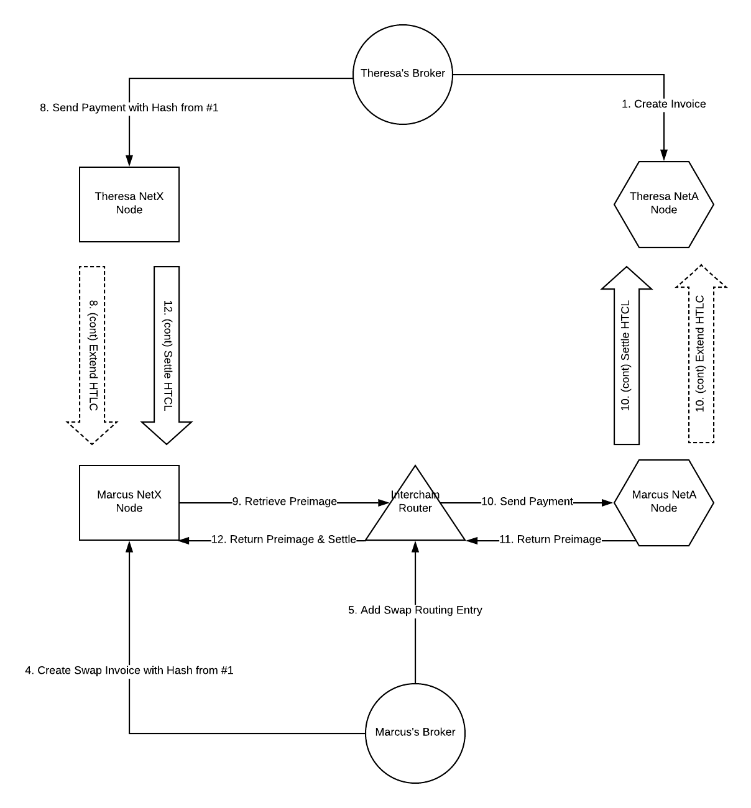

Interchain Router
=================

The Interchain Router is a service for Lightning Network nodes (and other similar Payment Channel Network nodes) to retrieve preimages for payments sent to that node by making a payment on another Payment Channel Network.

Design Overview
---------------

Let's consider two Payment Channel Networks, NetA and NetX, each of which support a single currency, ABC and XYZ, respectively.

Our participants are Marcus, who holds ABC on NetA, and Theresa, who holds XYZ on NetX. Both have the appropriate channels opened to the Relayer. Marcus is our Maker, setting the price on SparkSwap that he wants to trade at. Theresa is our Taker, taking an available price that is posted on SparkSwap.

Marcus places on order on the SparkSwap Relayer, offering to swap 10 ABC for 100 XYZ.

Theresa sees Marcus's order and wants to fill it on the SparkSwap Relayer.

1. Theresa creates an invoice on her NetA node for 10 ABC.
2. Theresa sends the swap hash associated with the NetA invoice she created in #1 to the Relayer while filling the order.
3. The Relayer sends Theresa's swap hash, along with her NetA address to Marcus.
4. Marcus adds a "swap invoice" to his NetX node associated with Theresa's swap hash.
5. Marcus adds a routing entry to his Interchain Router, along with Theresa's NetA address and the amount of XYZ and ABC expected.
6. Marcus notifies the Relayer that he is prepared for execution.
7. The Relayer sends Marcus's NetX address to Theresa.
8. Theresa sends a payment of 100 XYZ to Marcus's NetX node address, locked with the swap hash created in #1. (Note: the final CLTV delta of this payment needs to be >= the total CLTV delta of the payment in #10 + a delta for this node's processing).
9. Marcus, upon receiving the payment to his NetX node, finds that it is associated with the swap invoice he created in #4, and therefore he needs to retrieve the preimage across chains. His NetX node calls his Interchain Router with the swap hash and the amount of the inbound XYZ payment to retrieve the preimage.
10. Marcus's Interchain Router finds the swap invoice that was created in #5 using the provided hash and ensures that the amount of XYZ is appropriate. If so, it directs Marcus's NetA node to make a payment of 10 ABC to Theresa's NetA address.
11. When Marcus's payment to Theresa on NetA succeeds, his NetA node returns the preimage to his Interchain Router. His Interchain Router then returns the preimage to Marcus's NetX node.
12. Now in posession of the preimage for the NetX payment, Marcus' NetX node settles the payment and retrieves the XYZ paid to him by Theresa.

Service Details
---------------

The Interchain Router is a standalone service that is responsible for routing requests for preimages between chains that the Broker has access to. In its current implementation, the Interchain Router is a service that is started by and runs under the BrokerDaemon, using the same data store, but it need not be so tightly coupled.

The service is currently implemented as a gRPC service, and its definition is in [rpc.proto](./rpc.proto).

### Routing entries

The Interchain Router uses routing entries to:
- determine whether the request should be forwarded (i.e. does it meet all of our criteria and is it still valid)
- learn how to make a request to the downstream node to make the payment and retrieve the preimage.

Routing entries are records stored on the Interchain Router ahead of a preimage request to facillitate cross-chain preimage retrieval.

In its current implementation, these routing entries are Orders for which the Broker is the Maker.

To determine if we should forward the request, routing entries must contain:
- the expected inbound amount and currency
- the outbound amount and currency

To instruct the router how to forward the request, routing entries must contain:
- the outbound network
- address information for the node we are making an outbound payment to
- the amount of currency to forward
- the currency to forward (symbol)

Routing entries are not written to the data store by Interchain Router once they are created. Any state related to preimage retrieval should be stored by the engines on either end.

### Requesting preimages

The Interchain Router exposes a single RPC, `GetPreimage`, which requests a preimage from the Interchain Router, which in turn forwards the request to retrieve the preimage from the paired Payment Channel Network.

The request must include:
- the hash associated with the desired preimage (`payment_hash`)
- the amount of currency (in its integer units) in the HTLC extended to the requesting node (`amount`)
- the currency in the HTLC extended to the requesting node (`symbol`)
- the time lock in the HTLC extended to the requesting node (`time_lock`)
- the current block height on the origin blockchain (`best_height`)

This request opens a stream with the Interchain Router since the preimage retrieval on the paired blockchain may take significant time.

The stream is resolved with a single message back to the requesting node containing the preimage (`payment_preimage`) or the stream will be closed with an error.

### Making preimage requests

When the Interchain Router decides to forward a request to another Payment Channel Network, it does so by making a payment to the node specified in the routing entry with the amount of currency specified. This is typically done through the outbound node's standard payment RPC, relying on a well-specified payment rather than an invoice.

If this payment fails, then the original request for a payment preimage fails as well.

If the payment succeeds, we will then have access to the preimage associated with the hash, and can return it to the requesting node, allowing that node to settle its in-flight HTLC.